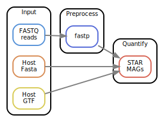

[](https://snakemake.github.io)
[](https://github.com/3d-omics/ht_quant/actions/workflows/main.yml)

# Snakemake workflow: `ht_quant`

A Snakemake workflow for Host Transcriptome Quantification


## Usage

1. Make sure you have `conda`, `mamba` and `snakemake` installed.
    ```bash
    conda --version
    snakemake --version
    mamba --version
    ```

2. Clone the git repository in your terminal and get in:
    ```bash
    git clone git@github.com:3d-omics/ht_quant.git  # or use https
    cd ht_quant
    ```

3. Test your installation by running the test data. It will download all the necesary software through conda / mamba. It should take less than 5 minutes.
    ```bash
    ./run
    ```

4. Run it with your own data:

   1. Edit `config/samples.tsv` and add your samples names, a library identifier to differentiate them, where are they located, the adapters used, and the coassemblies each sample will belong to. If no adapters are specified, they are asumed to be the current Nextera ones: `AGATCGGAAGAGCACACGTCTGAACTCCAGTCA` and `AGATCGGAAGAGCGTCGTGTAGGGAAAGAGTGT` for forward and reverse, respectively.

    ```tsv
    sample_id	library_id	forward_filename	reverse_filename	forward_adapter	reverse_adapter
    sample1	lib1	resources/reads/sample1_1.fq.gz	resources/reads/sample1_2.fq.gz
    sample2	lib1	resources/reads/sample2_1.fq.gz	resources/reads/sample2_2.fq.gz
    ```

    2. Edit `config/features.yml` with reference information:

    ```yaml
    dna: resources/reference/chrX_sub.fa.gz
    gtf: resources/reference/chrX_sub.gtf.gz

    sex_chromosomes: [X, Y]
    ```

    3. Edit `config/params.yml` with execution parameters. The defaults are reasonable.


5. Run the pipeline
     ```
     snakemake --use-conda --jobs 8 all
     #(slurm users), there is a script called run_slurm in the cloned directory that you can directly use to launch the pipeline on a slurm cluster, you can modify the parameters or direclty execute it as it is
     ./run_slurm
     ```


## Rulegraph




## Features
- FASTQ processing with `fastp`.
- mapping of preprocessed RNA reads against the host with `STAR`.
- Reporting with `fastqc`, `samtools`, `fastp` and aggregated with `multiqc`
- Count table aggregated with `R` and `tidyverse`


## References

- [`fastp`](https://github.com/OpenGene/fastp)
- [`samtools`](https://github.com/samtools/samtools)
- [`star`](https://github.com/alexdobin/STAR)
- [`FastQC`](https://github.com/s-andrews/FastQC)
- [`multiqc`](https://github.com/ewels/MultiQC)
